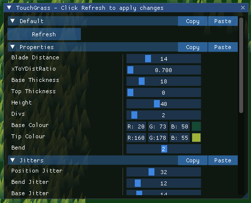
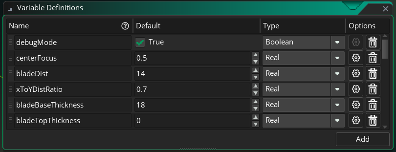

# TouchGrass for GameMaker

This is procedurally generated grass for your GameMaker games.

https://github.com/user-attachments/assets/931990c6-3545-4c56-8bde-c5c29a27efbb

You can adjust the blade sizes and colours, the bend, generation properties and wind properties.

You can assign a player object in the grass variables that will be checked as a collider, bending grass (only one collider is supported). The collider properties can also be adjusted.

## How to import

Download the .yymps file from the Releases.

Import into your project. Import the "TouchGrass" folder.

You can import the Demo Assets folder if you wish to test with the included demo assets.

## How to use

Place the `tg_oGrass` object in your room, resize it as needed.

Enable the `debugMode` variable in your grass object/instance to show a debug window where you can experiment with the parameters. This is enabled by default.

You will need to press Refresh at the top of the window for some parameters to take effect.

These parameter values can be edited in the grass object/instance in the GameMaker window.

Your instances will need to sort their depth with `depth = -bbox_bottom` for depth sorting to work with this grass.

## Setting a player

For the player to bend grass, you can do it in two ways:

* Set the `playerObject` variable in the grass's Variable Definitions, it will automatically find an instance at creation and assign it to `playerInst`
* Set the `playerInst` variable in the grass instances at runtime to an instance of your player

